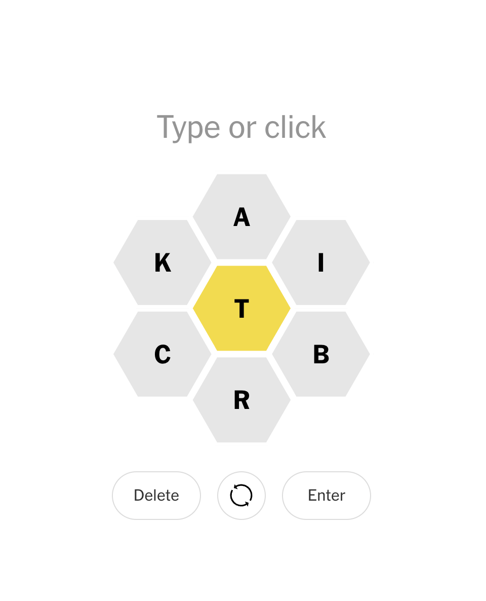

# New York Times Spelling Bee Solver




## Description
This Python script serves as a solver for the New York Times Spelling Bee game. It helps players find valid words based on the given letters on the game board. The solver utilizes a dictionary of English words to generate a list of valid words that adhere to the game's rules.

## Note on Word Validity

It's important to note that the solver utilizes a comprehensive dictionary of English words (`dict.txt`) to generate potential solutions. This dictionary may contain words that are valid in standard English usage but are not included in the New York Times Spelling Bee dictionary.

As a result, the solver may produce solutions that include words not recognized by the NYT Spelling Bee game.


## How to Use
1. Replace the placeholder `board_letters` and `key_letter` variables in the script with the actual letters provided on the game board and the center yellow letter, respectively.
2. Ensure that the `dict.txt` file containing a list of English words is in the same directory as the script.
3. Run the script to generate a list of valid words sorted by length.


## Usage
```bash
python parse.py

OR 

python3 parse.py
```


## Example 
### If:  
```
board_letters = "bowlmne"  # Enter all board letters
key_letter = "b"  # Enter the center yellow letter
```
### Output:
```
['noblewomen', 'noblemem', 'nonnoble', 'noblemen', 'bombonne', 'embolon', 'bellmen', 'embowel', 'ennoble', 'bolomen', 'bebloom', 'embloom', 'beelbow', 'moonbow', 'lowbell', 'bemoon', 'momble', 'beelol', 'emblem', 'womble', 'embolo', 'boneen', 'nobble', 'weeble', 'bemole', 'beneme', 'bomble', 'bellon', 'beemen', 'embole', 'wobble', 'belone', 'blowen', 'embowl', 'bonbon', 'lobolo', 'bowwow', 'beebee', 'bonnne', 'moeble', 'benben', 'enwomb', 'bennel', 'mobble', 'eelbob', 'bellow', 'bobble', 'bollen', 'booboo', 'bowmen', 'enweb', 'bonbo', 'nobel', 'noble', 'embow', 'obole', 'belee', 'bemol', 'bello', 'leben', 'bloom', 'below', 'boone', 'blown', 'bombo', 'bowel', 'benne', 'elbow', 'moble', 'beele', 'bobol', 'bombe', 'nebel', 'bonne', 'bowne', 'belle', 'bowle', 'eboe', 'bleb', 'obol', 'been', 'bene', 'blee', 'oboe', 'bool', 'bolo', 'ebon', 'bono', 'boon', 'boob', 'bowl', 'bown', 'bone', 'lobe', 'lobo', 'bole', 'blew', 'bowe', 'womb', 'bell', 'bomb', 'beno', 'bobo', 'bleo', 'boll', 'loob', 'boom', 'beme', 'blob', 'blow', 'eben', 'benn']
```

